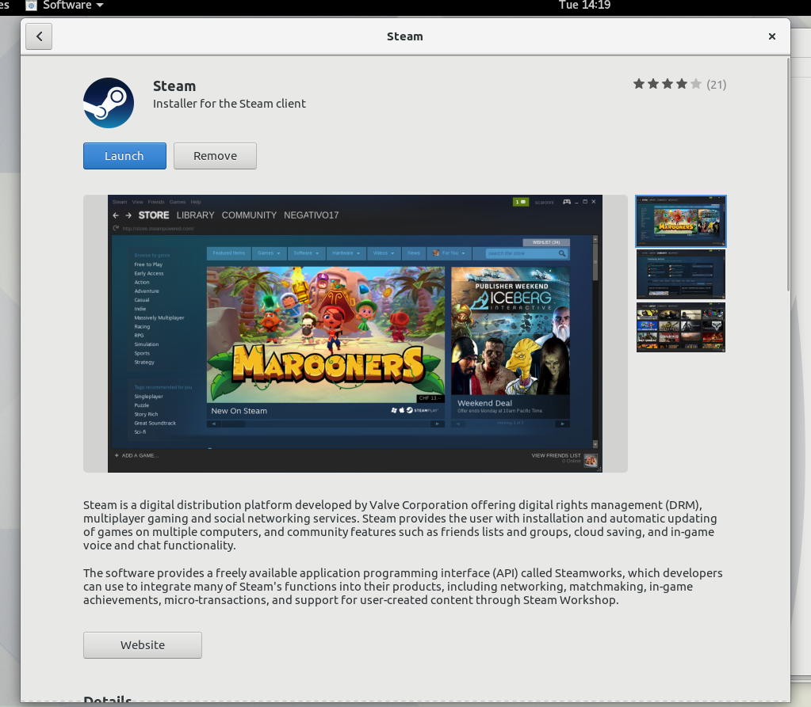

# {{page.title}}

**Written by Richard Hughes and Christian F.K. Schaller**

##Abstract

Traditionally we have had little information about Linux applications before they have been installed. With the creation of a software center we require access to rich set of metadata about an application before it is deployed so it it can be displayed to the user and easily installed.
This document is meant to be a guide for developers who wish to get their software appearing in the Software stores in Fedora Workstation and other distributions. Without the metadata described in this document your application is likely to go undiscovered by many or most linux users, but by reading this document you should be able to relatively quickly prepare you application.

###Introduction to the technical details

Installing applications on Linux has traditionally involved copying binary and data files into a directory and just writing a single desktop file into a per-user or per-system directory so that it shows up in the desktop environment.  In this document we refer to applications as graphical programs, rather than other system add-on components like drivers and codecs. This document will explain why the extra metadata is required and what is required for an application to be visible in the software center. We will try to document how to do this regardless of if you choose to pakcage your application as a rpm package or as a flatpak bundle. The current rules is a combination of various standards that have evolved over the years and will will try to summarize and explain them here, going from bottom to top. 

1. An introduction to [Desktop Application metadata](desktop-application-metadata-overview.md) 

2. Special steps to [ setup and create desktop yum repo](desktop-software-hosting.md) 

3. Instrunctions for  [how to host a Yum repo on github](how-to-host-yum-repo-on-github.md) 

4. How to [setup and host flatpaks](how-to-setup-and-host-flatpaks.md) 

5. How to  [Propose 3rd party Software for Fedora listing](how-to-propose-a-3rd-party-application-for-inclusion-in-fedora.md) 

###Summary
AppStream files allow us to build a modern software center experience either using legacy distro packages with yum-style metadata or with the new flatpak application deployment framework. By including a desktop file and AppData file for your Linux binary build your application can be easily installed by end users.
###Future Work
AppData currently uses the OARS content rating system which will be expanded for more uses cases and filtering options.
###	Related Work
The ODRS[1] is a web service which provides end-user moderated application reviews using the AppStream application ID.

